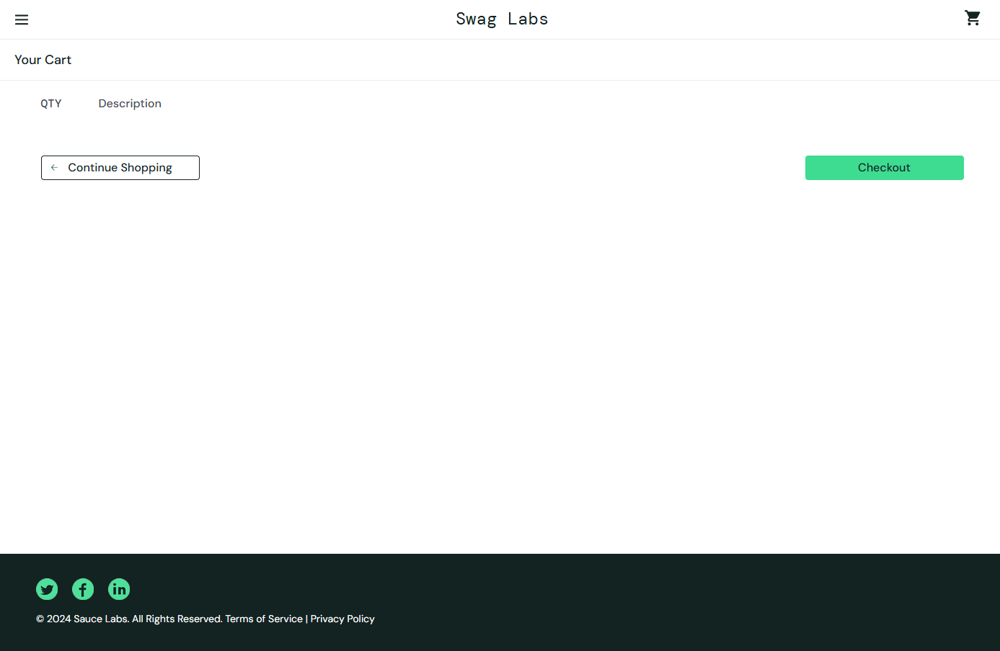
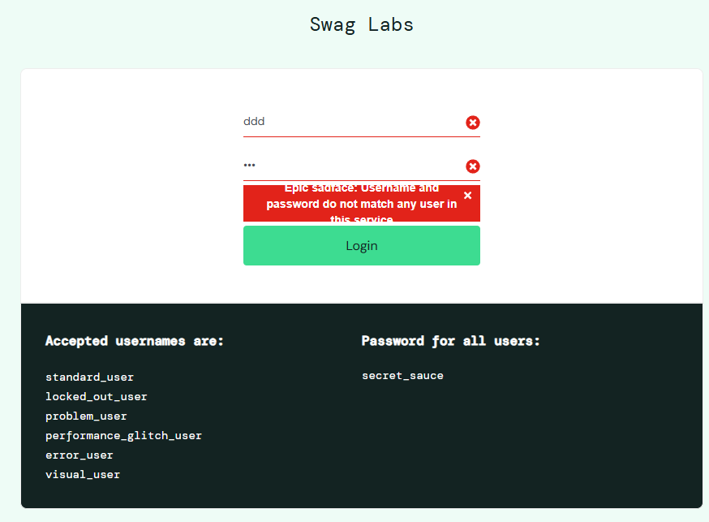

# Plano de Testes: Sauce Demo

## 1. Introdução

- **Objetivo**: Garantir a funcionalidade, usabilidade, segurança e desempenho do site Sauce Demo.
- **Escopo**: O plano abrange testes para as funcionalidades de login, navegação no catálogo de produtos, ordenação e filtragem de produtos, adição de produtos ao carrinho e finalização da compra.
- **Plataformas**: Testar em navegadores populares (Chrome, Firefox, Edge) e dispositivos desktop e mobile.

---

## 2. Escopo

### Funcionalidades a serem testadas

- **Login**:
  - Validação de credenciais corretas.
  - Tratamento de erros com credenciais inválidas.
  - Tratamento de erros com senhas inválidas.
  - Validação de comportamento com campos obrigatórios vazios:
    - Testar se os campos exibem mensagens claras para entradas ausentes.
  - Teste de limite de caracteres nos campos de entrada:
    - Verificar se o sistema limita o número de caracteres aceitáveis no username e senha.
  - Testes de segurança:
    - Bloqueio após múltiplas tentativas de login inválidas (brute force).
- **Navegação**:
  - Visualização correta dos produtos no catálogo.
  - Filtragem e ordenação de produtos.
  - Visualização correta das informações do produto ao abrir um produto.
- **Carrinho de compras**:
  - Adicionar e remover produtos.
  - Validação do total no carrinho.
- **Finalização de pedido**:
  - Preenchimento dos campos de checkout.
  - Confirmação de compra.
- **Mensagens de erro**:
  - Mensagens claras para entradas inválidas.

### Funcionalidades fora do escopo

- Testes de performance detalhados (como simulações de carga).

---

## 3. Tipos de Teste

- **Funcionais**:
  - Testar cada funcionalidade individualmente.
- **UI/UX**:
  - Garantir que a interface seja amigável e responsiva.
- **Regressão**:
  - Validar que alterações no sistema não introduzam erros.
- **Acessibilidade**:
  - Verificar conformidade com padrões como WCAG 2.1.
- **Cross-browser e Responsividade**:
  - Certificar que o site funciona bem em múltiplos navegadores e tamanhos de tela.

---

## 4. Abordagem de Teste

### Ambiente de Teste

- **URL do ambiente**: <https://www.saucedemo.com/>
- **Dados de teste**:
  - Usuário válido:
    - **Username**: `standard_user`
    - **Password**: `secret_sauce`
  - Usuário locked_out_user:
    - **Username**: `locked_out_user`
    - **Password**: `secret_sauce`
  - Usuários inválidos:
    - Username: `invalid_user` | Password: `wrong_password`

### Ferramentas

- **Automação**: PlayWriter
- **Teste manual**: TestRail, Qase ou Jira para gerenciamento de casos de teste.
- **Teste de acessibilidade**: axe-core

---

## 5. Casos de Teste

### Login

| ID    | Cenário                                         | Passos                                                                                                   | Resultado Esperado                                                                                    | Resultado Real                                                                                 | Status |
| ----- | ----------------------------------------------- | -------------------------------------------------------------------------------------------------------- | ----------------------------------------------------------------------------------------------------- | ---------------------------------------------------------------------------------------------- | ------ |
| TC001 | Login com credenciais válidas                   | 1. Acessar o site  2. Inserir `standard_user` e `secret_sauce` 3. Clicar em "Login"                | Usuário redirecionado para a página produtos.                                                         | Conforme esperado                                                                              | Passou |
| TC002 | Login com senha inválida                        | 1. Acessar o site 2. Inserir `standard_user` e senha inválida 3. Clicar em "Login"                 | Mensagem de erro exibida: `Epic sadface: Username and password do not match any user in this service` | Conforme esperado                                                                              | Passou |
| TC003 | Login com campos vazios                         | 1. Acessar o site 2. Deixar os campos de login e senha vazios 3. Clicar em "Login"                 | Mensagem de erro exibida: `Epic sadface: Username is required`                                        | Conforme esperado                                                                              | Passou |
| TC004 | Login com muitos caracteres                     | 1. Acessar o site 2. Inserir mais de 128 caracteres no campo de login e senha 3. Clicar em "Login" | Mensagem de limite máximo de caracteres deve ser exibida.                                             | É exibida mensagem `Epic sadface: Username and password do not match any user in this service` | Falhou |
| TC005 | Login com poucos caracteres                     | 1. Acessar o site 2. Inserir menos de 3 caracteres 3. Clicar em "Login"                            | Mensagem de limite minimo de caracteres deve ser exibida.                                             | É exibida mensagem `Epic sadface: Username and password do not match any user in this service` | Falhou |
| TC006 | Login com usuario contendo caracteres especiais | 1. Acessar o site 2. Inserir os caracteres `!@#$%^& *()` 3. Clicar em "Login"                      | Mensagem de usuario invalido.                                                                         | É exibida mensagem `Epic sadface: Username and password do not match any user in this service` | Falhou |

### Lista de produtos

| ID    | Cenário                                           | Passos                                                                                    | Resultado Esperado                                     | Resultado Real    | Status |
| ----- | ------------------------------------------------- | ----------------------------------------------------------------------------------------- | ------------------------------------------------------ | ----------------- | ------ |
| TC007 | Ordenar produtos pelo nome por ordem crescente    | 1. Fazer login 2. Selecionar ordenação `Name (A to Z)`                                 | Ordenação pelo nome dos produtos de A à Z              | Conforme esperado | Passou |
| TC008 | Ordenar produtos pelo nome por ordem decrescente  | 1. Fazer login 2. Selecionar ordenação `Name (Z to A)`                                 | Ordenação pelo nome dos produtos de Z à A              | Conforme esperado | Passou |
| TC009 | Ordenar produtos pelo valor por ordem decrescente | 1. Fazer login 2. Selecionar ordenação `Price (low to high)`                           | Ordenação pelo valor os produtos do menor para o maior | Conforme esperado | Passou |
| TC010 | Ordenar produtos pelo valor decrescente           | 1. Fazer login 2. Selecionar ordenação `Price (high to low)`                           | Ordenação pelo valor os produtos do maior para o menor | Conforme esperado | Passou |
| TC011 | Adicionar produto ao carrinho                     | 1. Fazer login 2. Adicionar um produto ao carrinho.                                    | Deve atualizar o contador no carrinho                  | Conforme esperado | Passou |
| TC012 | Acessar produto                                   | 1. Fazer login 2. Clicar no nome de um produto 3. Visualizar informações do produto | Deve conter informações e valor do produto.            | Conforme esperado | Passou |

### Carrinho de Compras

| ID    | Cenário                                               | Passos                                                                                                            | Resultado Esperado                          | Resultado Real                                   | Status |
| ----- | ----------------------------------------------------- | ----------------------------------------------------------------------------------------------------------------- | ------------------------------------------- | ------------------------------------------------ | ------ |
| TC014 | Remover produto do carrinho                           | 1. Fazer login 2. Adicionar um produto 3. Remover o produto 4. Verificar o carrinho                      | Carrinho vazio.                             | Mensagem intuitiva de que o carrinho esta vazio. | Falhou |
| TC015 | Adicionar produtos ao carrinho                        | 1. Fazer login 2. Adicionar um produto 3. Verificar o carrinho                                              | Carrinho com produtos.                      | Conforme esperado                                | Passou |
| TC016 | Finalizar compra com dados válidos                    | 1. Fazer login 2. Adicionar produto ao carrinho 3. Preencher os campos de checkout 4. Confirmar compra   | Pedido concluído com sucesso.               | Conforme esperado                                | Passou |
| TC017 | Finalizar compra com dados inválidos                  | 1. Fazer login 2. Adicionar produto ao carrinho 3. Deixar campos obrigatórios vazios 4. Confirmar compra | Mensagem de erro exibida.                   | Conforme esperado                                | Passou |
| TC018 | Atualizar página é verificar se os produtos permanece | 1. Fazer login 2. Adicionar produto ao carrinho 3. Atualizar a página                                       | Os produtos deve permanecer                 | Conforme esperado                                | Passou |
| TC019 | Valor total no carrinho                               | 1. Fazer login 2. Adicionar produto ao carrinho                                                                | Deve conter o valor dos produtos com a taxa | Conforme esperado                                | Passou |
| TC020 | Finalizar compra sem adicionar nenhum produto         | 1. Fazer login 2. Verificar carrrinho. 3. Atualizar                                                         | Deve conter o valor dos produtos com a taxa | Conforme esperado                                | Passou |

### Logout

| ID    | Cenário                                         | Passos                                                                                              | Resultado Esperado                                   | Resultado Real    | Status  |
| ----- | ----------------------------------------------- | --------------------------------------------------------------------------------------------------- | ---------------------------------------------------- | ----------------- | ------- |
| TC021 | Deslogar usuário                                | 1. Fazer login 2. Clicar em logout                                                               | Tela de login.                                       | Conforme esperado | Sucesso |
| TC022 | Acessar pagina do carrinho de compras deslogado | 1. Fazer login 2. Clicar em logout.   3. Acessar o link `https://www.saucedemo.com/cart.html` | Tela de login com mensagem de que é necessario logar | Conforme esperado | Sucesso |

### Testes de Responsividade

| ID     | Cenário                               | Passos                                 | Resultado Esperado                                | Status   |
| ------ | ------------------------------------- | -------------------------------------- | ------------------------------------------------- | -------- |
| RES001 | Verificar menu em dispositivos móveis | 1. Abrir a aplicação em tela de 320px. | Menu deve ser exibido como ícone de hambúrguer.   | Aprovado |
| RES002 | Validar layout responsivo no catálogo | 1. Redimensionar janela para 768px.    | Produtos devem se reorganizar corretamente.       | Aprovado |
| RES003 | Testar o fluxo de compra em mobile    | 1. Executar o fluxo em tela de 375px.  | Layout funcional e sem sobreposição de elementos. | Aprovado |

---

## 6. Cronograma ( Modelo )

| Atividade                | Data de Início | Data de Término |
| ------------------------ | -------------- | --------------- |
| Planejamento do teste    | 22/11/2024     | 23/11/2024      |
| Execução manual          | 24/11/2024     | 25/11/2024      |
| Automação de casos chave | 26/11/2024     | 28/11/2024      |
| Relatório de resultados  | 29/11/2024     | 29/11/2024      |

---

## 7. Métricas de Sucesso

- **Taxa de sucesso dos testes**: 95% dos casos de teste devem passar.
- **Defeitos por funcionalidade**: No máximo 2 defeitos críticos por funcionalidade.
- **Cobertura de testes**: 100% das funcionalidades críticas cobertas.

## Lista de Bugs

### Bug 001: Não é bloqueado o usuario de criar cobrança com carrinho vazio

- **Descrição**: Realizar compras sem adicionar nenhum produto ao carrinho de compras.
- **Severidade**: Crítico
- **Prioridade**: Alta
- **Passos**:
  1. Acesse a URL `https://www.saucedemo.com`.
  2. Insira `standard_user` e `secret_sauce`.
  3. Clique em "Login".
  4. Clica no carrinho de compras.
  5. Finalize o fluxo
- **Resultado Esperado**: Mensagem clara informando "Adicione produtos ao carrinho.".
- **Resultado Real**: Finalização do fluxo sem nenhum produto ao carrinho.
- **Evidência**:
  

  ### Bug 002: Usuários podem inserir nomes de usuário ou senhas com um número excessivo de caracteres

- **Descrição**: Acessar pagina de login, e inserir mais de 500 caracteres.
- **Severidade**: Crítico
- **Prioridade**: Alta
- **Passos**:
  1. Acesse a URL `https://www.saucedemo.com`.
  2. Insira mais de 500 caracteres no campo de username.
- **Resultado Esperado**: Mensagem clara informando o limite maximo de caracteres permitido "O nome de usuário deve ter no máximo 50 caracteres." é para senha "A senha deve ter no máximo 100 caracteres.".
- **Resultado Real**: Mensagem de que usuario não esta cadastrado. `Epic sadface: Username and password do not match any user in this service
`
- **Evidência**:
  

## Sugestões de Melhorias UX/UI

### Problema 1: Layou da mensagem de senha incorreta

- **Impacto**: Usuários pode não perceber claramente a mensagem que esta com layout desajustado
- **Sugestão**: Ajustar layout para se ajustar ao tamanho da mensagem.
